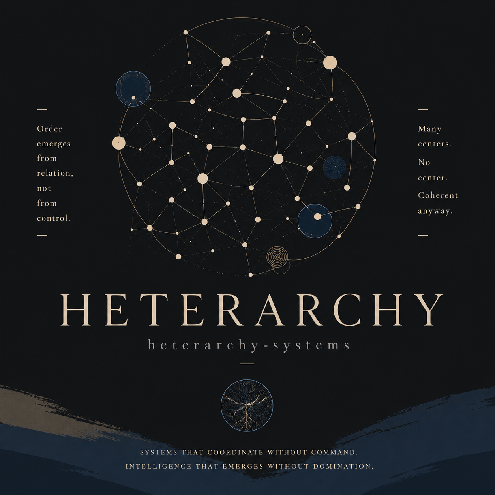

 

# HETERARCHY

### Order emerges from relation, not from control.

**Many centers. No center. Coherent anyway.**

---

Heterarchy Systems is an independent engineering organization exploring how autonomous systems can **coordinate, remember, reason, and act together** without assuming that intelligence must originate from a single center.

We are interested in systems where each participant can remain autonomous while contributing to something larger: shared context, distributed coordination, collective reasoning, and persistent memory.

> **Heterarchy is not the absence of structure.**
> **It is structure without a permanently privileged center.**

 

## What we build

INFRASTRUCTURE FOR DISTRIBUTED INTELLIGENCE

We build the foundations that allow independent systems to **coordinate, persist, and become coherent without surrendering their autonomy.**

 

### 01 — Agent Coordination

**Independent minds need ways to find one another.**

Systems for agents to discover capabilities, delegate work, collaborate across boundaries, and converge on shared outcomes.

---

### 02 — Distributed Systems

**Coordination must survive the absence of a center.**

Reliable communication, state transition, fault tolerance, and consistency across autonomous participants.

---

### 03 — Memory & Context

**Intelligence that cannot remember cannot accumulate.**

Persistent context and knowledge that allow systems to preserve experience, recover intent, and build upon what came before.

---

### 04 — Orchestration

**Order does not require permanent command.**

Mechanisms for coordinating work, responsibility, and execution without reducing every interaction to a fixed top-down hierarchy.

---

### 05 — Evidence-Driven Intelligence

**Action should remain connected to what made it reasonable.**

Systems that preserve the path from **observation → inference → decision → action**, keeping intelligence inspectable, traceable, and grounded.

 

### Not one intelligence controlling many systems.

### Many systems becoming intelligent together.

---

## HETERARCHY

**Systems that coordinate without command.**
**Intelligence that emerges without domination.**

 

`heterarchy-systems`

